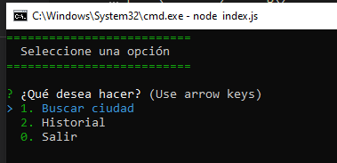

# SMDev - ClimaApp

Aplicación construida en el curso de NodeJS para buscar obtener el clima de una ciudad desde la consola

## Actividades

- Obtener la ciudad a buscar desde la terminal.

- Buscar los resultados similares al termino de búsqueda con el Api de Mapbox Search Places.

- Mostrar en consola los resultados para permitir seleccionarlos (máximo 5).

- De acuerdo al sitio seleccionado, obtener sus coordenadas y consultar el Api de Open Weather Map para obtener el clima actual.

- Finalmente, mostrar al usuario los datos como el clima, temperatura, etc.

- Como Bonus, mostrar el historial de búsquedas realizadas (los últimos 6 registros) y poder seleccionarlos para obtener los datos del clima

## Instalación y Demo

- Para ejecutar el programa se debe tener instalador **NodeJS**
- Abrir una terminal en el directorio del proyecto
- Ejecutar el comando ```npm install``` para instalar las dependencias
- Ejecutar el comando ```npm run start``` para correr el proyecto con el interprete de **Node**
- Hecho esto se podrá visualizar en la consola una interfaz similar a la siguiente: 



## Autor
> Stalin Maza - Software Developer

## Inspiración
> Curso NodeJS - De cero a Experto por Fernando Herrera